# Лабораторно-практична робота №5

## Розширення бекенд-додатку власними сутностями та реалізація REST API

## Діаграмма сутностей:


## Короткий опис реалізованих сутностей:
### City - сутність описує всі міста.
### Practice_place - сутність описує всі місця практики та їх популярність.

## Основні контролери:

### 1. **City**

**Функції:**

* `GET /city` — перегляд списку міст
* `POST /city` — додати місто
* `PUT /city/:id` — редагувати
* `DELETE /city/:id` — видалити

---

### 2. **Practice_place**

**Функції:**

* `GET /practice_places` — перегляд усіх місць практики
* `GET /practice_place/:id` — перегляд конкретного місця
* `POST /practice_place` — додавання нового місця (HR)
* `PUT /practice_place/:id` — редагування
* `DELETE /practice_place/:id` — видалення

---
## Скріншоти з Postman

`POST /city` — додати місто
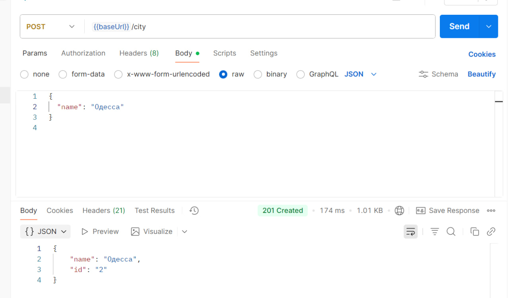

`GET /city` — перегляд списку міст
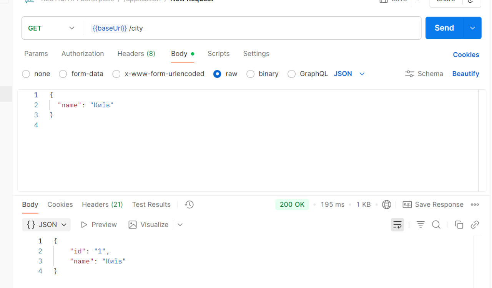

`PUT /city/:id` — редагувати
* 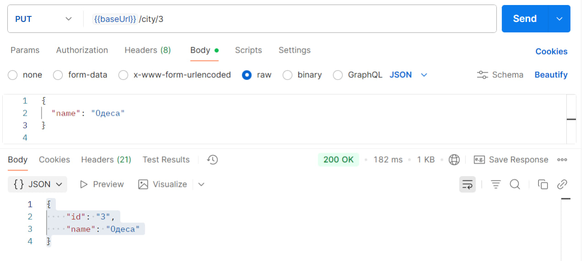

`DELETE /city/:id` — видалити
* 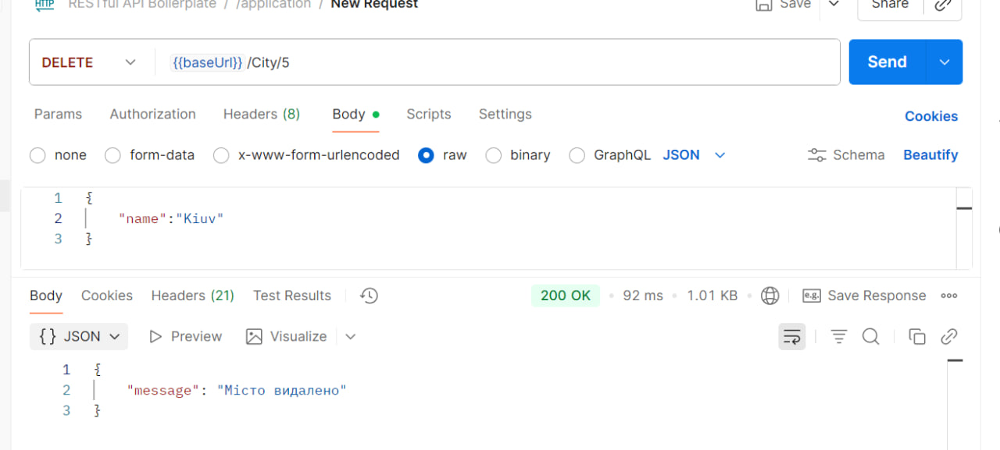

`POST /practice_place` — додавання нового місця (HR)
* 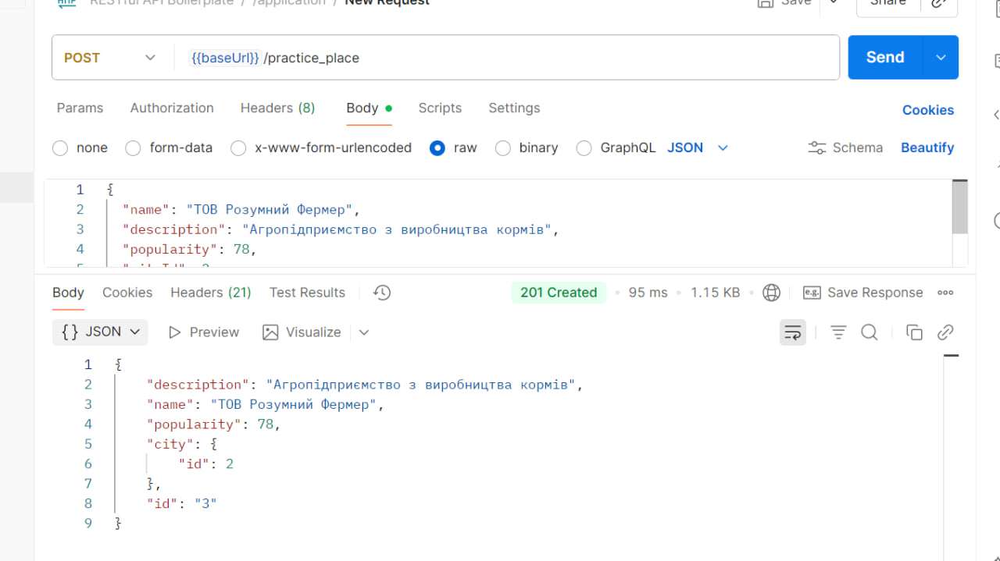

`GET /practice_places` — перегляд усіх місць практики
* 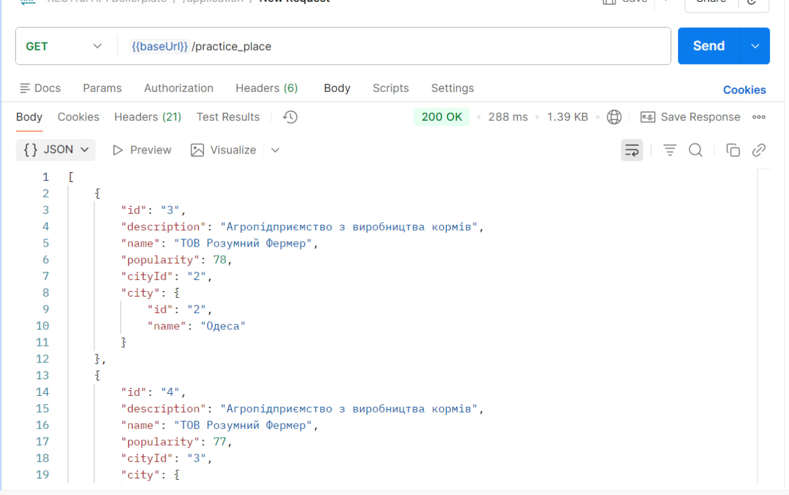

`GET /practice_place/:id` — перегляд конкретного місця
* 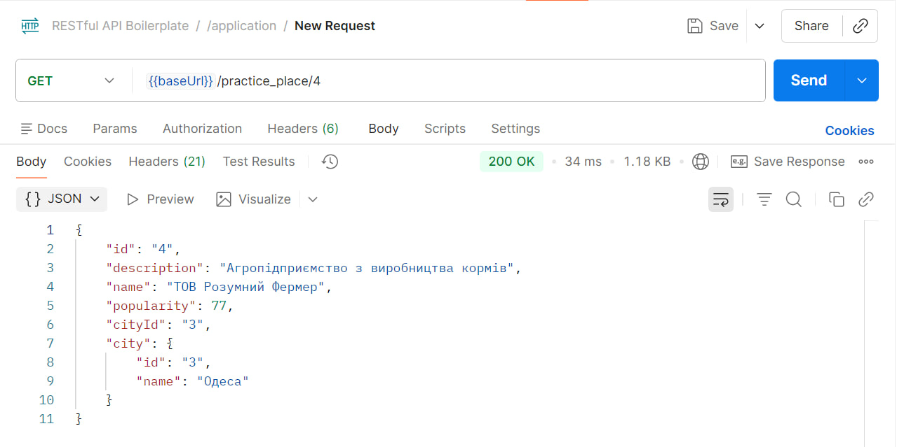

`PUT /practice_place/:id` — редагування
* 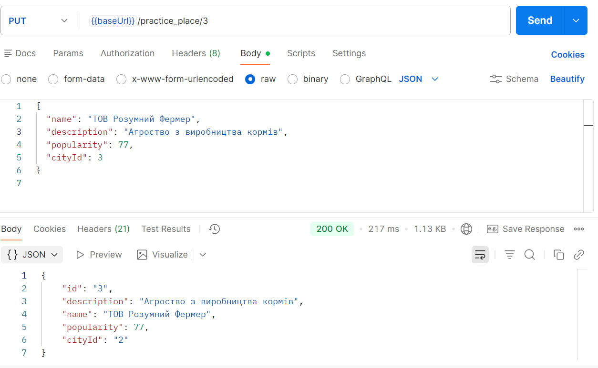

`DELETE /practice_place/:id` — видалення
* 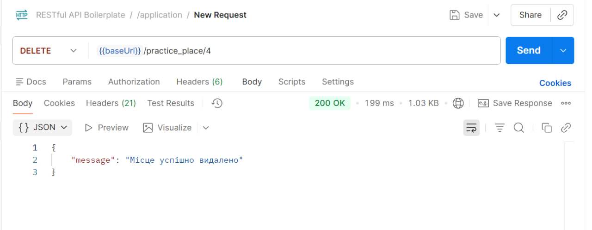

# Лабораторно-практична робота №6

# Впровадження сервісного шару, валідації та DTO

## Шари додатку

### Middleware — Валідація вхідних даних

Middleware-функції перевіряють коректність даних до передачі їх у бізнес-логіку.  
У разі помилки — створюється об’єкт CustomError із статусом 400 Bad Request.

### Controller — Оркестрація запиту

Контролери відповідають за:

- прийом запиту від клієнта,
- виклик відповідного сервісу,
- формування та повернення відповіді або помилки.

Контролер не містить бізнес-логіки — лише координує запит.

### Service — Бізнес-логіка

Сервіси реалізують бізнес-правила додатку.
Вони працюють з даними, виконують перевірки, звертаються до репозиторіїв і повертають результат у вигляді DTO.

### Repository — Доступ до даних

Репозиторії реалізовані через TypeORM.
Вони забезпечують роботу з базою даних: пошук, створення, оновлення та видалення сутностей.

## Приклад Коду

Нижче наведено приклади реалізації нової архітектури для сутності city (місто).

### Middleware

```
import { Request, Response, NextFunction } from 'express';
import validator from 'validator';

import { CustomError } from '../../../utils/response/custom-error/CustomError';

export const validatorCreateCity = async (req: Request, res: Response, next: NextFunction) => {
  try {
    const { name } = req.body;

    const errorsValidation: { [key: string]: string }[] = [];

    const nameStr = name !== undefined && name !== null ? String(name).trim() : '';
    if (validator.isEmpty(nameStr)) {
      errorsValidation.push({ name: "Поле 'Назва міста' є обов’язковим" });
    }

    if (errorsValidation.length > 0) {
      throw new CustomError(400,'Validation','Помилка валідації міста',null,null,errorsValidation);
    }

    next();
  } catch (err) {
    next(err);
  }
};

```

### DTO

```
iimport { city } from '../orm/entities/city';

export class cityDto{
    Id: number;
    Name: string; 

    constructor(city: city) {
        this.Id = city.id;
        this.Name = city.name;

    }
}
```

### Service

```
import { getRepository } from 'typeorm';
import { city } from '../orm/entities/city';
import { cityDto } from '../DTO/cityDto'
import { CustomError } from '../utils/response/custom-error/CustomError';

export class cityservices {
    private cityRepository = getRepository(city);

    async getAllCities() {
    const cities = await this.cityRepository.find();
    return cities.map((c) => new cityDto(c));
    }

    async getCityById(id: number) {
    if (isNaN(id)) {
      throw new CustomError(400, 'Validation', 'invalid ID city');
    }
    const city = await this.cityRepository.findOne({ where: { id } });
    if (!city) {
      throw new CustomError(404, 'General', 'city not found');
    }

    return new cityDto(city);
    }

    async createCity(data: Partial<city>){
        const city = this.cityRepository.create(data);
        const created = await this.cityRepository.save(city);
        return new cityDto(created);

    }

    async updateCity(id: number, data: Partial<city>) {
    if (isNaN(id)) {
      throw new CustomError(400, 'Validation', 'invalid ID city');
    }
    const city = await this.cityRepository.findOne({ where: { id } });
    if (!city) {
      throw new CustomError(404, 'General', 'city not found ');
    }

    Object.assign(city, data);
    const updated = await this.cityRepository.save(city);
    return new cityDto(updated);
  }

  async deleteCity(id: number) {
    if (isNaN(id)) {
      throw new CustomError(400, 'Validation', 'invalid ID city');
    }

    const result = await this.cityRepository.delete(id);
    if (!result.affected) {
      throw new CustomError(404, 'General', 'city not found');
    }

    return { message: `city with ID ${id} correctly deleted` };
  }
}
```

## Скріншоти Postman

### Успішний запит

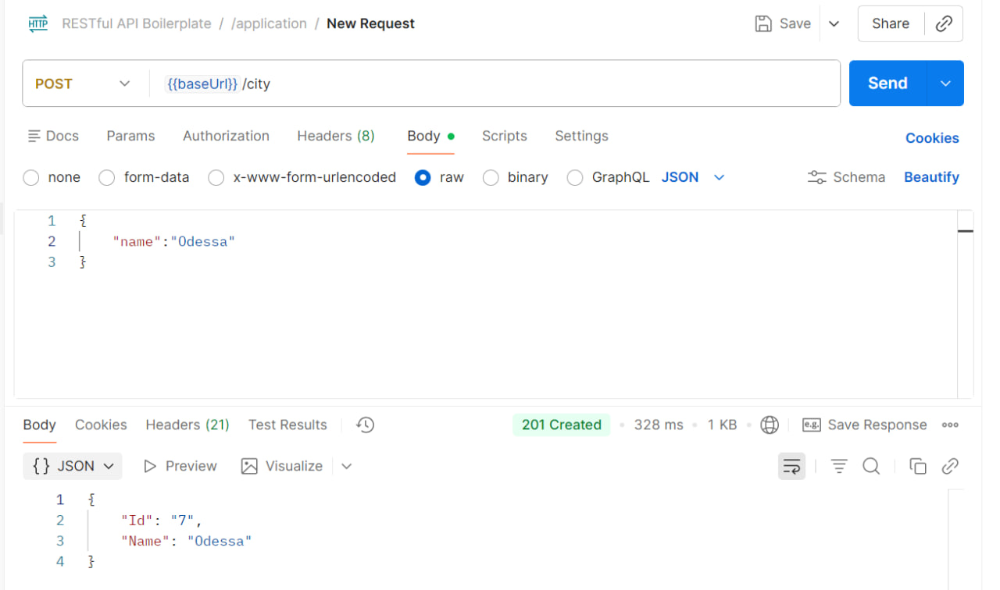

### Поганий запит

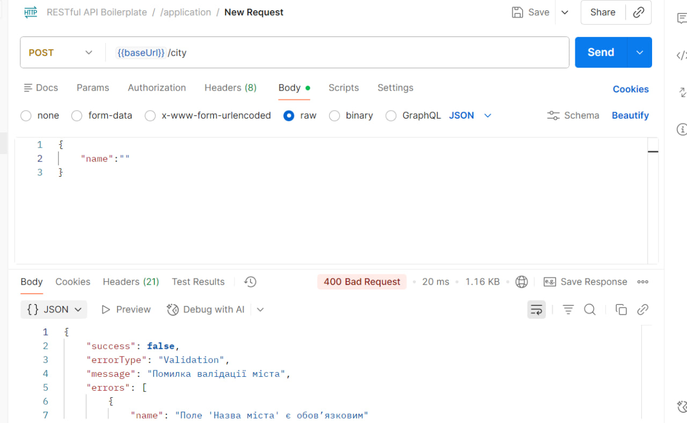
